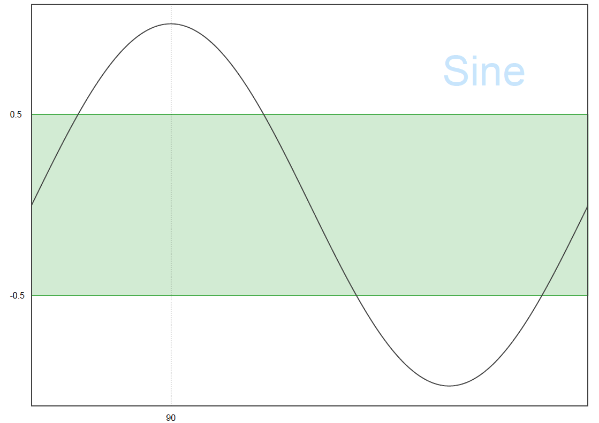
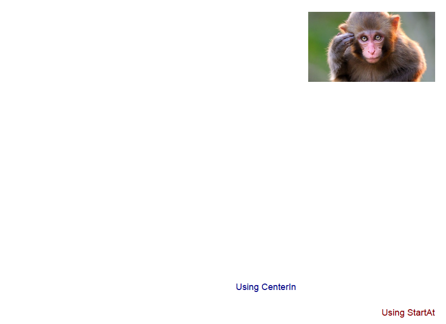
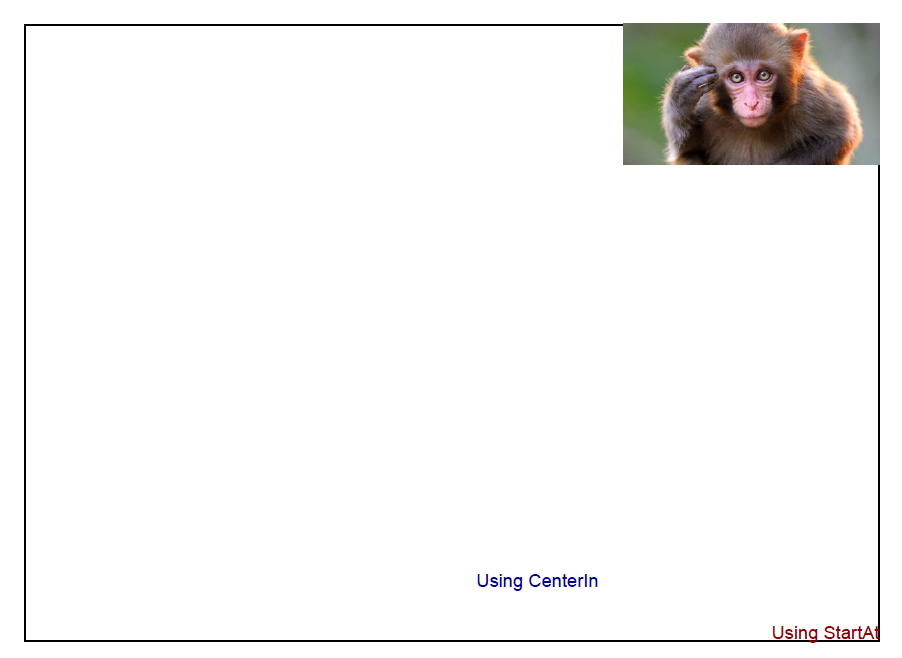
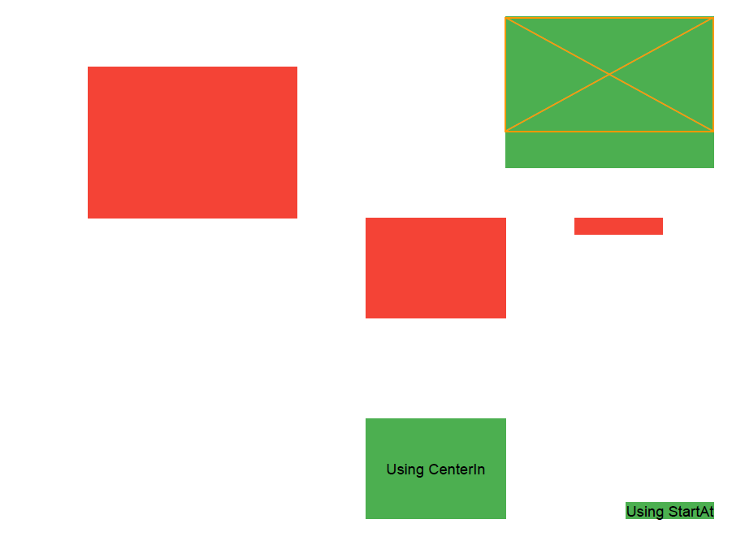
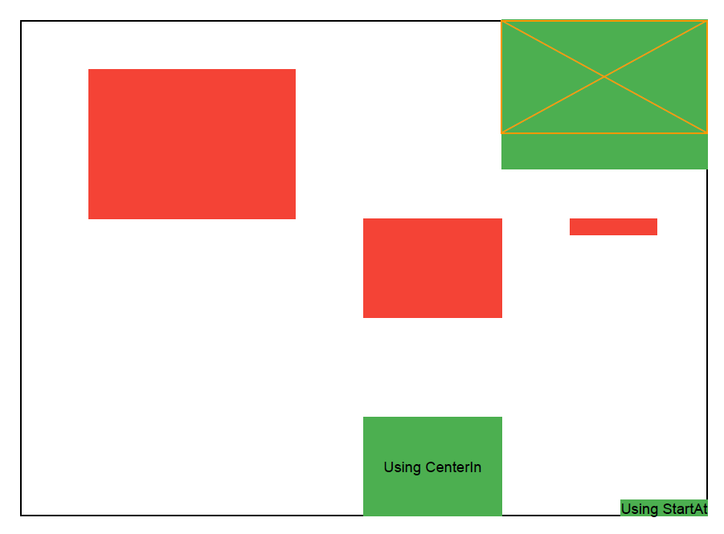

## Easy to use PDF generation library for C#

### General information
*  Language: C#
*  Target framework: .NET Framework 4.5
*  Versions: According to [Semantic Versioning](https://semver.org/)

### How to install
1.  Download the repository and put the [latest version folder](Binaries) of Pidify in your project folder.
2.  Go to "References > Add Reference"
3.  Click "Browse" and select all *.dll file in the Pidify-vXXX folder.
4.  Click "Ok"

### Documentation
The overall structure can seen in the list below.

*  [Canvases](Pidify/Canvases)
Contains implemented ICanvas/ICanvasConfig classes.

*  [Plottables](Pidify/Plottables)
Contains implemented IPlottable classes.

*  [Utils](Pidify/Utils)
Contains utility classes.

*  [ICanvas](Pidify/ICanvas.cs)
Interface which is used to create the actual PDF.

*  [ICanvasConfig](Pidify/ICanvasConfig.cs)
Interface which handles configuration for a ICanvas.

*  [Area](Pidify/Area.cs)
Class which simplifies drawing of IPlottable instances on a canvas
inside a box.

The architecture is flexible. You don't need Area or IPlottable to create a PDF.
Rather, they are used to simplify the creation of the PDF.
The pre-implemented ICanvas [PdfSharpCanvas](Pidify/Canvases/PdfSharpCanvas.cs) uses PDFSharp
to create the PDF but any underlying ICanvas, if it is implemented according to the ICanvas contract
can be used with any of the IPlottable instance.

### Usage example: creating a graph
This usage example shows how to create a simple graph and customize it.

```csharp
var area = Area.NewInstance(PointPair.NewInstance(.0f, .0f, 1f, .5f), 1337);

var sine = new List<float>();
for (var a = 0.0; a < 2 * Math.PI; a += Math.PI / 180)
{
    sine.Add((float)Math.Sin(a));
}

// Uses pre created colors with alpha on a white background.
var legendColor = Colors.ApplyAlpha(0.25f, Colors.Blue);
var horizontalFillColor = Colors.ApplyAlpha(0.25f, Colors.Green);

var graph = GraphPlottable.Builder.NewInstance()
    .SetBorder(LineInfo.NewInstance(DarkGrey, 1f))
    .AddLine(sine, LineInfo.NewInstance(Colors.DarkGrey))
    .AddLegend("Sine", TextInfo.NewInstance(FontType.Helvetica, 40f, legendColor), 0.75f, 0.1f)
    .AddVerticalLine(LineInfo.DefaultDashed, 90, "90")
    .AddHorizontalLine(LineInfo.NewInstance(Colors.Green, 1f), 0.5f, "0.5")
    .AddHorizontalLine(LineInfo.NewInstance(Colors.Green, 1f), -0.5f, "-0.5")
    .SetHorizontalFill(-.5f, .5f, horizontalFillColor)
    .SetAxisLimits(null, Tuple.Create(-1.1f, 1.1f))
    .Build();
area.AddPlottable(graph);

var pdfCanvas = new PdfSharpCanvas();
area.Draw(pdfCanvas);
pdfCanvas.End(FileUtil.IncrementFilenameIfExists("C://PATH//TO//DESKTOP//test.pdf"));
```

Which produces the following PDF:

 


### Usage example: using request mode
This usage example shows how the request mode can be used to manage placement of IPlottables.

Note that the image used can be found here: [Figures/test-monkey-jpg-file.jpg](Figures/test-monkey-jpg-file.jpg).

```csharp
var area = Area.NewInstance(PointPair.NewInstance(.0f, .0f, 1f, .5f), 1337);

// Creates the text plottable with StartAt. Note that the color is not applied in some modes.
var textStartAt = TextPlottable.Builder
    .NewInstance("Using StartAt", TextInfo.NewInstance(FontType.Helvetica, 12f, Color.DarkRed))
    .SetStartAt(0.8f, 0.4f)
    .SetGravity(GravityType.Bottom, GravityType.Right)
    .Build();
area.AddPlottable(textStartAt);

// Creates the text plottable with CenterIn. Note that the color is not applied in some modes.
var textCenterIn = TextPlottable.Builder
    .NewInstance("Using CenterIn", TextInfo.NewInstance(FontType.Helvetica, 12f, Color.DarkBlue))
    .SetCenterIn(PointPair.NewInstance(.5f, .4f, .7f, .6f))
    .SetGravity(GravityType.Bottom)
    .Build();
area.AddPlottable(textCenterIn);

// Creates the image plottable. Note that the image is not displayed in some modes.
var image = ImagePlottable.Builder.NewInstance("C://PATH//TO//test-monkey-jpg-file.jpg")
    .SetScale(ScaleType.FitStart, PointPair.NewInstance(.1f, .1f, .4f, .4f))
    .SetGravity(GravityType.Right, GravityType.Top)
    .Build();
area.AddPlottable(image);

// Applies the mode on the canvas.
var pdfCanvas = new PdfSharpCanvas()
    .RequestMode(ModeParam.None);

// Creates the PDF.
area.Draw(pdfCanvas);
pdfCanvas.End(FileUtil.IncrementFilenameIfExists("C://PATH//TO//DESKTOP//test.pdf"));
```

#### ModeParam.None
This mode shows the production PDF.

```csharp
// Applies the mode on the canvas.
var pdfCanvas = new PdfSharpCanvas()
    .RequestMode(ModeParam.None);
```
The resulting PDF can be seen below.




#### ModeParam.Boxed
This mode surrounds the plottables drawn through an Area with a black box.

```csharp
// Applies the mode on the canvas.
var pdfCanvas = new PdfSharpCanvas()
    .RequestMode(ModeParam.Boxed);
```

Which produces the PDF below.




#### ModeParam.Calibration
This mode asks the plottables to draw extra information to help in placing them.

```csharp
// Applies the mode on the canvas.
var pdfCanvas = new PdfSharpCanvas()
    .RequestMode(ModeParam.Calibration);
```

Which produces the PDF below.



#### ModeParam.BoxedCalibration
This mode combines ModeParam.Boxed and ModeParam.Calibration.

```csharp
// Applies the mode on the canvas.
var pdfCanvas = new PdfSharpCanvas()
    .RequestMode(ModeParam.BoxedCalibration);
```

Which produces the PDF below.




### Usage example: extensive
This usage example shows a complete pdf using most of the functionality offered.
Note that is uses Resources.fb which is a resource bitmap which has to be replaced
if ran in another project.

```csharp
// Use same page for all plottables.
const int pageId = 1337;

//
// Adds the title and the sub-title.
//
var header = PointPair.NewInstance(0.2f, 0f, 0.8f, 0.2f);
var headerArea = Area.NewInstance(header, pageId);

var titleTextInfo = TextInfo.NewInstance(FontType.Helvetica, 24, Colors.DarkGrey);
var titlePlottable = TextPlottable.Builder.NewInstance("Sine and Cosine", titleTextInfo)
    .SetGravity(GravityType.Top)
    .Build();

var subTitleTextInfo = TextInfo.NewInstance(FontType.Helvetica, 16, Colors.Grey, FontStyle.Italic);
var subTitlePlottable = TextPlottable.Builder
    .NewInstance("December 2019", subTitleTextInfo)
    .SetCenterIn(PointPair.NewInstance(0.25f, 0.2f, 0.75f, 0.4f))
    .Build();

// Adds the plottables to the area.
headerArea.AddPlottable(titlePlottable)
    .AddPlottable(subTitlePlottable);

//
// Adds the graph.
//
var north = PointPair.NewInstance(0.2f, 0.2f, 0.8f, 0.5f);
var northArea = Area.NewInstance(north, pageId);

// Generates the data.
var sine = new List<float>();
var cosine = new List<float>();
for (var a = 0.0; a < 2 * Math.PI; a += Math.PI / 180)
{
    sine.Add((float)Math.Sin(a));
    cosine.Add((float)Math.Cos(a));
}

// Creates the plottable.
var sineLegendTextInfo = TextInfo.NewInstance(FontType.Arial, 20f, Colors.Red);
var cosineLegendTextInfo = TextInfo.NewInstance(FontType.Arial, 20f, Colors.Blue);
var graph = GraphPlottable.Builder.NewInstance()
    .AddLine(sine, LineInfo.NewInstance(sineLegendTextInfo.Color, 2f))
    .AddLine(cosine, LineInfo.NewInstance(cosineLegendTextInfo.Color, 2f))
    .AddLegend("Sine", sineLegendTextInfo, 0.6f, 0.1f)
    .AddLegend("Cosine", cosineLegendTextInfo, 0.6f, 0.2f)
    .SetBorder(LineInfo.NewInstance(Colors.DarkGrey))
    .Build();

northArea.AddPlottable(graph);

//
// Adds the inficon logo and the comment section.
//
var south = PointPair.NewInstance(0.2f, 0.5f, 0.8f, 0.8f);
var southArea = Area.NewInstance(south, pageId);

var facebookPlottable = ImagePlottable.Builder.NewInstance(Resource.fb)
    .SetScale(ScaleType.FitCenter, PointPair.NewInstance(0, 0, 0.5f, 0.5f))
    .SetGravity(GravityType.Right)
    .Build();

southArea.AddPlottable(facebookPlottable);


// Creates the comments area.
var commentsPlottable = CommentsPlottable.Builder
    .NewInstance(.1f, "Comments", TextInfo.NewInstance(FontType.Helvetica, 12, Colors.DarkGrey))
    .SetStartAt(0, .5f)
    .SetLines(4, 1, LineInfo.NewInstance(Colors.Grey, .5f))
    .Build();

southArea.AddPlottable(commentsPlottable);

//
// Adds the divider line and the version info.
//
var footer = PointPair.NewInstance(0, .95f, 1, 1);
var footerArea = Area.NewInstance(footer, pageId);

var dividerPlottable = LinePlottable.NewInstance(PointPair.LineTop, LineInfo.Default);

footerArea.AddPlottable(dividerPlottable);

// Creates the version text.

var versionTextInfo = TextInfo.NewInstance(FontType.Helvetica, 8f, Colors.DarkGrey);
var versionPlottable = TextPlottable.Builder.NewPidifyVersionInstance(versionTextInfo, "pidify-")
    .SetGravity(GravityType.Bottom, GravityType.Left)
    .Build();
footerArea.AddPlottable(versionPlottable);

//
// Draws all areas on the canvas.
//
var canvas = new PdfSharpCanvas();

headerArea.Draw(canvas);
northArea.Draw(canvas);
southArea.Draw(canvas);
footerArea.Draw(canvas);

//
// Generates the PDF.
//
canvas.End(FileUtil.IncrementFilenameIfExists("C://PATH//TO//DESKTOP//test.pdf"));
```

Which produces the PDF found [here](Figures/extensive.pdf).

### Changelog
Again, [Semantic Versioning](https://semver.org/) is used. This means that versions are formatted as MAJOR.MINOR.PATCH.

*  MAJOR: Incompatible functionality and changes.
*  MINOR: Backward compatible functionality.
*  PATCH: Backward compatible bug fixes.

#### v1.0.0
Release initial version.

#### v1.0.1
*  Fixed bug from GraphPlottable#SetAxisMarkers which failed when values in the graph were too close to eachother.
*  Fixed bug in GraphPlottable where Horizontal and Vertical-Lines were applied over or below the axis values.

#### v1.1.0
*  Implemented a [CommentsPlottable](Pidify/Plottables/CommentsPlottable.cs) to create comment boxes.
*  Implemented a [SignaturePlottable](Pidify/Plottables/SignaturePlottable.cs) to create signature lines.

#### v1.1.1
*  Fixed bug where CommentsPlottable didn't apply the color specified on the title.

#### v2.0.0
*  Replaced Area#DrawBoxed with [ModeParam](Pidify/Utils/ModeParam.cs) which offers additional
   functionality with IPlottable implementations. See ICanvasConfig#RequestMode and
   ICanvas#GetModeParam. Each IPlottable can use this mode help in creating the PDF.
   Current only [TextPlottable](Pidify/Plottables/TextPlottable.cs) 
   and [ImagePlottable](Pidify/Plottables/ImagePlottable.cs) support it, see their
   respective XML comment. [Area](Pidify/Area.cs) support DrawBoxed through ModeParam.Boxed
   and ModeParam.BoxedCalibration.
   
*  Added [Colors](Pidify/Utils/Colors.cs) which provides some materialistic colors and some helper methods
   when working with colors.
   
*  Added an overloaded method to GraphPlottable.Builder#SetAxisMarkers which takes functions
   to transform the index/value to any string marker. Can be used to e.g. add a unit.
   
   